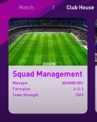
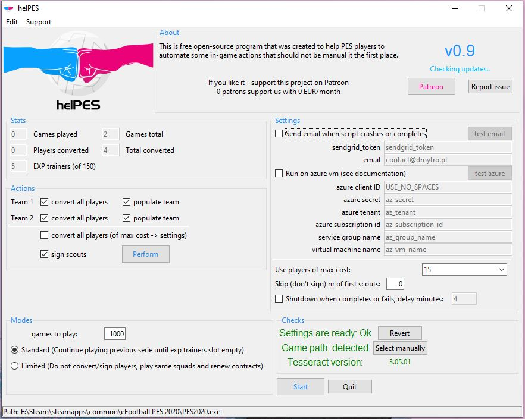
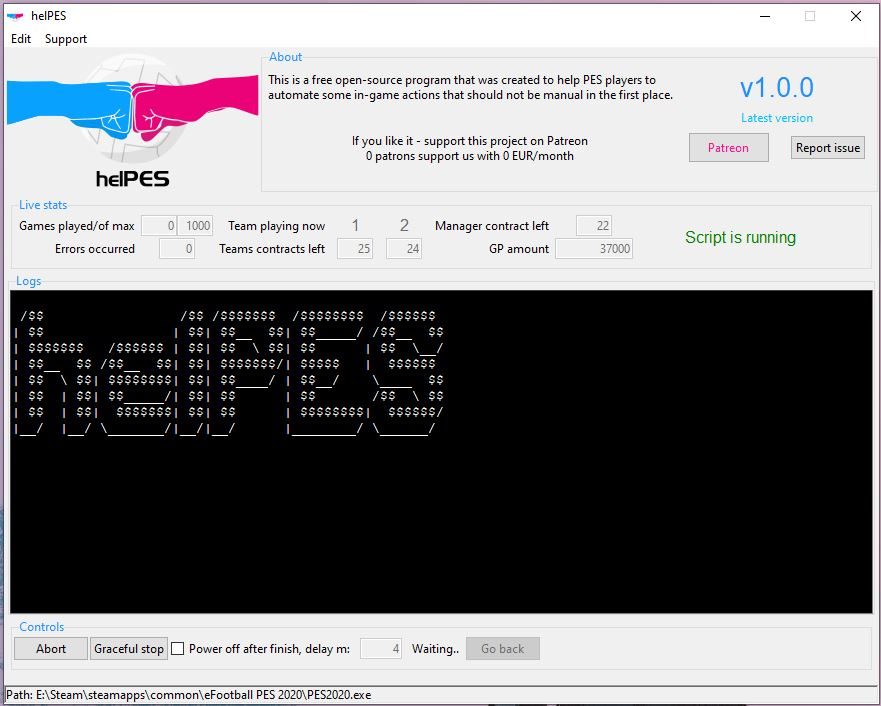

# helPES

### This application automates some Pro Evolution Soccer (PES) routines in myClub

-----
### Features:
- Sign your scouts (with possibility to skip first 6+ scouts, 0 - for no skipping)
- Convert your players to EXP trainers (converts all players of **cost** below selected, eg 10, 15, 20..).
- Playing SIM games with the same squads (alternately plays first two squads from list, extends contracts when expired)
- Playing SIM games wasting squads:
    - Alternately plays first two squads from list
    - When contracts expire - signs earned scouts, converts both squads (except bench players) to EXP trainers, selects new players of "max cost"
    - Cycle continues specified number of games or until scout or EXP trainers slots available
    - **This mode is extremely profitable, as you save GP and gain EXP trainers, yet you need to have higher number of players/scouts to waste, as each cycle of 20 games you'll lose 22 players but gain only 20 new scouts**
    
**Added in 1.1.0:**
- PES2021 support
- Standalone, just extract zip archive and run helPES.exe

##### Additional features:
- If program fails - send email with a screenshot and last 30 log entries
- Auto shutdown computer when program fails/completes
- Possibility to run on Azure Virtual Machine with shutting down VM when completes
#### Limitations:
- ~~As for now only supports PES2020~~ (fixed in v1.1.0)
- Only supports PC version of game
- Program resizes game window to 1280x720 and manipulates it emulating controller, you can't use your computer in meanwhile
- Program detects game by window name (eg. "eFootball PES 2020"), if you have folder with same name opened it can mull
- Entire game window must be visible on your PC screen, program itself doesn't need to
- As for now **only** supports usage of **managers with 4-3-3 tactics**
- As for now to use email sending you'll need your own sendgrid token (see wiki instructions or youtube video)
- For using on Azure VM you'll need to set it up and provide the program with all the necessary credentials
- When choosing "scouts to skip" can only choose 0 or 6+
- You need to start "Playing loop" or "Actions" only from:
    - desktop before PES even started
    - myClub **Club House/Squad Management:**
    
    

##### Known issues:
- helPES won't start if Steam is not installed
- On first run it can detect PES executable but may fail to run it, should work after helPES restart.
-----

### Requirements:
To successfully use helPES you will need:
- Windows 10 (PC or Azure VM with graphic card)
- ~~tesseract ocr installed (it is used for visual recognition of text on your game screen - v [3.05.1](https://digi.bib.uni-mannheim.de/tesseract/tesseract-ocr-setup-3.05.01.exe) from [this source](https://digi.bib.uni-mannheim.de/tesseract/) was used. instalation path should be added to PATH so `tesseract` should be callable from terminal)~~ Starting from v1.2.0 it is now standalone program with no dependencies.

### Installation
1. ~~Install tesseract-ocr~~ (fixed in v1.1.0)
2. ~~Add tesseract-ocr executable to system PATH (see wiki for detailed steps)~~ (fixed in v1.1.0)
3. Download and extract the archive with the latest program version to a folder, enter it and run helPES.exe 
4. Windows can warn you of untrusted software producer, it is because the program is generated from code above and does not have software producer's signature
### Usage:
1. Open helPES.exe make sure everything is "green" in **Checks section**:
    - **Settings are ready** - each time you run the program your PES settings file will be backed up and replaced by the one provided by this program. **When you done with the usage of program - press "Revert" button to revert to your original settings file**
    - **Game path** - it should automatically detect your PES2020/1.exe file, if it doesn't - please report an issue.
    - **Tesseract version** - it will show included tesseract version.
2. Configure **Settings**
    - **Send email** - if you select this and provide your email and sendgrid token - each time script completes it will send you an email with statistics, also when it fails - will take screenshot of game window, attach last 30 lines of detailed logs and send it to you. Use the **Test email** button to send yourself a test mail and make sure everything is working fine.
    - **Run on azure vm** - this only affects the way the machine is turned off after the program is failed/completed. If selected and all necessary information provided - instead of shutting down **deallcoate** call will be sent to Azure instance, so it will be correctly stopped and won't spend your funds.
    - **Use players of max cost** - is self explanatory, for any purpose only players of selected and below costs will be used.
    - **Skip scouts** - it will skip first n scouts when signing players. Use it if you have some 5-stars scouts you would like to keep.
    - **Shutdown** - when the program fails or completes it will shut down computer/VM with specified delay in minutes. To stop countdown or unset auto shutdown just deselect it at any time during program run.
3. Actions - there is several checkboxes for selection, when selected press **Perform** button to start performing selected actions:
    - **Convert all players (Team 1/2)** will convert all players from selected squad (except bench players)
    - **Pupulate team (1/2)** will select new players of max cost (see Settings) for the selected squads
    - **Sign scouts** if selected will be performed first, it will sign all scouts skipping first n (see Settings)
    - **Convert all** - alternative way to convert not needed players to EXP trainers, this will just go to your current squad, to reserves, filter all reserves players **by cost**, and will convert them one by one. There is a better "builtin" way to convert all at once via myClub Members menu, but there you can only filter by overall rating.
4. Modes - just select one of two **Standard/Limited** modes of SIM games, and let the program run it for you.
    - **Standard** will waste your scouts and players of max costs, will run specified nr of games or until is out of EXP or scout slots.
        - During "populating" squad it will try to use players on their natural position, so your chances to win or draw in a SIM game is higher.
    - **Limited** will just use the same squads and renew contracts.
    - In all cases program will use top two squads from "Squad list" and alternately play them (this is to keep teams stamina high and increase chances of higher rewards and EXP points gained by players what can make them more valuable EXP trainers later)
5. Running screen:
    - **Live stats**:
        - shows how many games played of scheduled (or max possible)
        - how many errors occurred
        - which team is playing now
        - how much contracts left for each team, for manager
        - how much "last seen" GP you have
        - program running status
    - **Controls**:
        - Abort - will start "aborting" the app, it might take few seconds up to a minute.
        - Graceful stop - it will finish the current game and stop.
        - Duplicating the "Power off" check from Settings, when countdown starts you can uncheck it to prevent shutdown.
        - Go back - only active when program is not running.
        

------------

##### If you like it please support us on:

